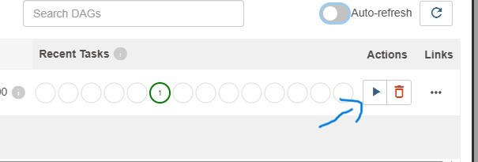

# 📊 Stock Data Pipeline with Apache Airflow & PostgreSQL

This project is a **Dockerized data pipeline** built using **Apache Airflow** and **PostgreSQL**.  
It automatically fetches stock market data, inserts it into a Postgres database, and manages workflows with Airflow DAGs.  
Everything runs inside Docker — no need to install Airflow or Postgres manually.

---

## 🛠️ Prerequisites
- **Docker** (Install from [Docker Official Site](https://www.docker.com/))  
- **Git**  

⚠️ **Windows Users Note**:  
If Docker asks you to update WSL, run:
```bash
wsl --update
```

Start the Docker engine.

---

## 🚀 Setup Instructions

> ⚠️ Use **Command Prompt (cmd)**, not PowerShell, as the project was developed in a cmd environment.  
> Recommended to use **VS Code** for convenience.

### 1️⃣ Clone the Repository
```bash
git clone <repo url>
```

### 2️⃣ Navigate into the Repo
```bash
cd <cloned repo>
```

### 3️⃣ Build & Start Docker Containers
```bash
docker-compose up -d --build
```


You will see this in terminal.

### 4️⃣ Initialize Airflow Database
```bash
docker compose exec airflow_webserver airflow db init
```


### 5️⃣ Create Airflow Admin User
```bash
docker compose exec airflow_webserver airflow users create --username admin --firstname Admin --lastname User --role Admin --email admin@example.com --password admin
```

Run this **after the Airflow Webserver starts**.  


---

### 6️⃣ Access Airflow Web UI
Wait until the server fully starts, then visit:  
👉 **http://localhost:8081**  

Login with:  
- **Username:** `admin`  
- **Password:** `admin`  

---

### 7️⃣ Trigger the DAG
In the Airflow UI, trigger the event (as shown below):  


⚠️ Make sure the **Airflow Scheduler** is running, otherwise tasks will remain queued.

---

### 8️⃣ Verify Data in PostgreSQL
To verify the data pipeline:  

Open a terminal in VS Code project folder and run:
```bash
docker exec -it postgres psql -U rahul -d stockdatabase
```

(Username and DB name can be changed in the `docker-compose.yml` file.)  

Run SQL query:
```sql
select * from stocks;
```


---

✅ That’s it! You now have a working **Airflow + Postgres Stock Data Pipeline** inside Docker.  
No need to install Airflow or Postgres locally — Docker handles everything 🚀
