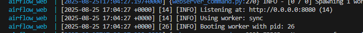

Stock Data Pipeline with Apache Airflow

This project is a containerized data pipeline built using Apache Airflow and PostgreSQL.
It automatically fetches stock market data, inserts it into a Postgres database, and manages the workflow using Airflow DAGs.

The setup is fully Dockerized so you can get the entire pipeline running with several commands:
Steps to be followed:
1 => clone the repository using git clone <repo url>

2 => cd <cloned repo>

3 => Run 'docker-compose up -d --build'

You will see this in terminal

4 => Then Run 'docker compose exec airflow_webserver airflow db init'

You will see this in terminal 

5 => Then Run 'docker compose exec airflow_web airflow users create --username admin --firstname Admin --lastname User --role Admin --email admin@example.com --password admin' in a single line

Run this after the airflow Web UI Starts; Check this using 'docker-compose logs -f airflow_webserver'
You will something like 

You can quit from logging by clicking Ctrl + C

               OR

Just verify by visiting the airflow web ui using 'localhost:8081', If it opens and asks the login credentials then you run that command 

Then login using username:admin; password:admin(As we given in that command)

6 => Then trigger the event by clicking like the image given below

7 => You can verify the working by visiting the database using cmd

